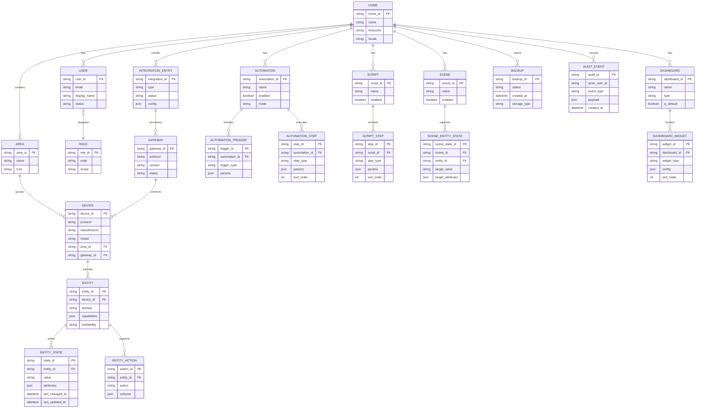
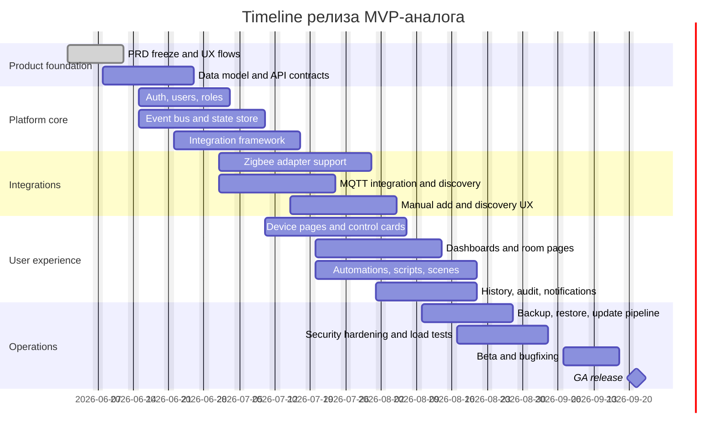

# Home Assistant и PRD для MVP-аналога

## Executive summary

Home Assistant сегодня — это open-source платформа автоматизации дома с позиционированием **local control and privacy first**, широким каталогом интеграций, опциональным облаком и собственной аппаратной экосистемой. На главной странице проект прямо акцентирует локальное управление, приватность и каталог в **3500+ integrations**, а вокруг ядра построена коммерческая оболочка Nabu Casa: подписка Home Assistant Cloud и официальное железо вроде Home Assistant Green. При этом облако не является обязательным для базовой работы платформы. citeturn14search11turn16search1turn16search2turn17search0turn14search1

С точки зрения продуктовой логики Home Assistant решает ключевую проблему умного дома: **фрагментацию протоколов, брендов и UX**. Он сводит разные физические устройства и внешние сервисы к унифицированным объектам — integrations, devices, entities, services, states — и поверх этого слоя дает единый UI, automation engine, scenes, scripts, dashboards и мобильные приложения. Важнейший архитектурный вывод для MVP-аналога: главная ценность не в количестве поддержанных брендов сама по себе, а в качественном **нормализующем слое** между устройствами, правилами и интерфейсом. citeturn0search4turn7search1turn36search0turn36search2turn30search0

Для MVP-аналога разумно строить **local-first single-home platform** с упором на: учетную запись владельца и администраторов, модель area/device/entity, UI управления устройствами, базовые automations/scripts/scenes, dashboard builder, историю и журнал событий, backup/restore, OTA-обновления, а также минимальный, но хорошо спроектированный integration layer. В качестве протокольного ядра для MVP целесообразно взять **Zigbee + MQTT + REST/WebSocket API**, а **Z-Wave** перенести во вторую очередь, потому что даже в Home Assistant он требует отдельного adapter/server/integration контура, security keys и учета региональных radio frequencies. Это не аргумент против Z-Wave в принципе, а аргумент против включения его в самый первый релиз. citeturn33view0turn31search0turn34view0turn34view1turn32search0

Ключевое конкурентное преимущество Home Assistant на рынке — **редкая комбинация** локального исполнения, open-source extensibility, зрелого пользовательского интерфейса, огромной экосистемы интеграций и опционального облака вместо обязательного. Но в этом же лежит и его слабость: сложность модели, исторический багаж YAML/legacy-подходов, неоднородность ролей и прав, а также необходимость понимать разницу между Core, Supervisor, apps, integrations и companion apps. Русскоязычные практические обзоры тоже подчеркивают именно это сочетание сильной гибкости и заметной инженерной сложности. citeturn14search11turn19search2turn19search3turn20search1turn22search6turn22search10

## Позиционирование, целевые пользователи и коммерческая модель

Home Assistant адресует как минимум три отчетливых сегмента пользователей. Это частично следует из официального позиционирования проекта для DIY-аудитории и “family and friends” через Home Assistant Green, а частично — из архитектуры платформы, developer docs и партнерской экосистемы. Формально такая сегментация в одной странице документации не сведена в явный маркетинговый фреймворк, но как аналитический вывод она хорошо подтверждается совокупностью источников. citeturn14search11turn17search0turn18search5turn21search16

| Сегмент | Что хочет получить | Что в Home Assistant особенно ценно | Риск/барьер |
|---|---|---|---|
| Домашние пользователи | Один центр управления, локальная работа, понятные панели, сценарии “ушёл/вернулся/ночь” | Автогенерируемый dashboard, drag-and-drop dashboards, mobile companion apps, scenes, automations, optional cloud extras | Онбординг и терминология сложнее, чем у cloud-first платформ |
| Энтузиасты | Максимум интеграций, кастомизация, локальный контроль, протоколы, YAML и API | Open source, 3500+ integrations, Zigbee/Z-Wave/MQTT, custom themes, app ecosystem, REST/WebSocket API | Рост сложности конфигурации и сопровождения |
| Интеграторы и продвинутые DIY-инсталляторы | Гибкая предметная модель, единый runtime, воспроизводимость установки, расширяемость | Supervisor/apps, config entries, area/device/entity model, dashboards per use case, APIs, открытые стандарты | Полноценная стабильная RBAC-модель в пользовательской документации явно **не указана**; permissions в developer docs отмечены как experimental and not enabled/enforced |

Для бизнеса Home Assistant интересен не как “приложение для лампочек”, а как **операционная система домашней автоматизации**: пользователь подключает устройства, назначает их по комнатам, объединяет в сущности и сервисы, строит панели, затем переводит бытовые правила в автоматизации и сцены. Поверх этого появляются вторичные use cases: удаленный доступ, бэкапы, медиасервисы, energy management, voice, сертифицированные устройства и мобильные сенсоры. Именно поэтому ядро ценности — не UI-контролы, а слой **“discovery → normalization → control → automation → observable state”**. citeturn7search1turn30search0turn36search0turn12search0turn13search6

Коммерческая модель экосистемы Home Assistant выглядит так:

| Поток value/монетизации | Что известно | Вывод для MVP-аналога | Источник |
|---|---|---|---|
| Open-source core | Базовая платформа распространяется как open source; обязательной подписки для локальной работы нет | Это снижает барьер входа и ускоряет adoption, но усложняет прямую монетизацию ядра | citeturn14search11turn18search5 |
| Home Assistant Cloud | Подписка дает secure remote access, voice assistant connectivity и другие extras; после trial — $6.50/мес или $65/год для США/International | Для аналога логично иметь optional paid cloud extras, но не делать cloud обязательным | citeturn16search1turn16search2turn16search8turn16search11 |
| Официальное оборудование | Home Assistant Green позиционируется как easiest way to run Home Assistant; Nabu Casa делает hardware, а прибыль поддерживает Open Home Foundation | Hardware может быть отдельным каналом монетизации и “упаковкой сложности” для массового сегмента | citeturn17search0turn14search1 |
| Партнерская/фондационная модель | Open Home Foundation финансируется commercial partner fees и donations; Nabu Casa перечисляет значимую часть прибыли в foundation | Для нового продукта возможна модель “open core + коммерческий оператор + партнерская программа совместимости” | citeturn18search20turn18search1turn18search16 |

Главные конкурентные преимущества Home Assistant по отношению к альтернативам можно свести к четырем тезисам. Во-первых, это **локальность по умолчанию** и отсутствие обязательной облачной зависимости. Во-вторых, это одновременно **open-source и consumer-usable** продукт, что резко отделяет его и от закрытых consumer ecosystems, и от более “инженерных” open-source конкурентов. В-третьих, Home Assistant сочетает ширину поддерживаемых устройств с сильной протокольной базой. В-четвертых, он строит экосистему вокруг открытых стандартов, приватности и устойчивости, а не только вокруг собственного vendor lock-in. Это аналитический вывод по совокупности официальных материалов платформ и конкурентов. citeturn14search11turn19search2turn19search3turn20search1turn21search17turn18search8

| Платформа | Как позиционируется | Где Home Assistant сильнее | Где Home Assistant слабее |
|---|---|---|---|
| Google Home | Thousands of devices, strong app UX, automations, Gemini-powered home experience | Локальность без обязательного облака, open-source extensibility, более глубокая низкоуровневая интеграция | Сложнее онбординг и меньше consumer polish “из коробки” | citeturn20search1turn20search5turn20search15turn14search11 |
| SmartThings | Hub Connected devices run locally via Edge; strong vendor ecosystem | Более открытая и гибкая архитектура, больше DIY/кастомизации, сильнее self-hosting story | Меньше “enterprise/vendor certification feel” для массового OEM-рынка | citeturn21search17turn21search0turn21search16turn14search11 |
| openHAB | No cloud required, private at home, open source | Более дружелюбный consumer UX, больше mainstream momentum и проще визуальная сборка dashboards | openHAB тоже силен в локальности и OSS, поэтому отрыв не абсолютный | citeturn19search2turn12search0turn12search5turn22search10 |
| Hubitat | Local, reliable, fast, private hub with built-in automations | Более широкий software ecosystem и стандартный API surface; нет жесткой привязки к одной hardware-форме | Hubitat проще артикулирует value как готовый hub appliance | citeturn19search3turn14search11turn34view0turn34view1 |

## Как устроен Home Assistant сегодня

Архитектурно Home Assistant разделяется на несколько слоев. **Core** — это Python-based runtime, в котором исторически описываются Event Bus, State Machine, Service Registry и Timer. **Integrations** подключают внешние устройства и сервисы. **Entities** становятся унифицированным объектом данных и управления. **Config entries** фиксируют пользовательскую конфигурацию, созданную через UI-флоу. **Frontend** — официальный web UI, реализованный как современное TypeScript/Lit-приложение и использующий WebSocket API для связи с backend. citeturn0search4turn7search1turn30search0turn24search13turn34view0

**Supervisor** в Home Assistant — это отдельный контейнерно-ориентированный управляющий слой для Home Assistant Core и связанных приложений. Официальный README описывает его как container-based system for managing Core installation and related applications; через Supervisor можно управлять сетевыми настройками, установкой и обновлениями ПО. В документации по Supervisor также прямо сказано, что он отвечает за установку, обновление Home Assistant Core, обновление Home Assistant Operating System и умеет автоматически откатывать Core при неуспешном обновлении. Это продуктово очень важный паттерн: **безопасные обновления и единый control plane** — одна из скрытых причин зрелости Home Assistant. citeturn25view0turn0search2turn3search10

Третий слой — **apps** (прежнее название — add-ons). Официальная developer-документация прямо говорит, что apps extend the functionality around Home Assistant: это может быть MQTT broker, Samba, File Editor и другие приложения, настраиваемые через Supervisor panel. В Home Assistant OS по умолчанию есть official core app repository и community app repository; при этом документация отдельно предупреждает, что для third-party apps качество и безопасность не гарантируются, а developer docs описывают app security rating со шкалой от 1 до 6. Для аналога это означает, что marketplace расширений нужно строить не раньше, чем будут готовы sandboxing, permission model и trust framework. citeturn6search0turn24search2turn4search0turn6search13

Отдельно важно учитывать эволюцию installation model. В мае 2025 Home Assistant официально объявил deprecation для **Core** и **Supervised** installation methods, что усиливает ставку на **Home Assistant OS** как рекомендуемую управляемую установку и на Container-режим для экспертных сценариев. Для нового продукта это хороший сигнал: не стоит проектировать MVP вокруг множественных исторических способов установки; лучше сразу выбирать один “managed appliance” путь и один “expert/container” путь. citeturn3search7turn3search10turn4search0

Ниже — прикладное сравнение ключевых функциональных блоков Home Assistant и их значения для MVP-аналога.

| Область | Как работает в Home Assistant | Что это значит для MVP-аналога | Источник |
|---|---|---|---|
| Device abstraction | Интеграции представляют devices/services через entities; user config хранится в config entries | Нужен строгий normalized device model, а не набор ad hoc драйверов | citeturn7search1turn30search0 |
| State model | State object хранит state, attributes, timestamps, context | Нужен один канонический state envelope для UI, rules и history | citeturn36search0 |
| Service model | Стандартизированные entity domains дают control actions; интеграции могут регистрировать и custom service actions | Нужно развести generic actions и protocol-/vendor-specific actions | citeturn7search1turn36search1 |
| Frontend/runtime link | Официальный frontend общается с backend через WebSocket API; REST тоже доступен | Для real-time UI WebSocket обязателен, REST — для CRUD и интеграции | citeturn24search13turn34view0turn34view1 |
| Safe operations | Supervisor управляет обновлениями и rollback; в OS доступны backups и restore | Без backup/restore и safe-update MVP будет восприниматься как игрушка | citeturn0search2turn4search0turn16search11 |
| Extensibility | Есть apps/add-ons, official/community repos, custom integrations, themes | Marketplace и custom plugins лучше оставить после стабилизации ядра | citeturn6search0turn24search2turn37search0 |

Поддержка протоколов и discovery в Home Assistant очень показательна для проектирования MVP, потому что в ней видна не только “ширина поддержки”, но и **стоимость сложности**.

| Протокол/канал | Текущая модель в Home Assistant | Вывод для MVP-аналога | Приоритет |
|---|---|---|---|
| Zigbee | ZHA работает как hardware-independent gateway, auto-discovery через USB/Zeroconf, поддерживает добавление устройств, groups/binding, OTA updates и backups/migration | Отличный кандидат в MVP: высокая ценность, понятный локальный сценарий, много устройств | MVP citeturn33view0 |
| Z-Wave | Нужны adapter + Z-Wave server + integration + end devices; есть network security keys, региональные radio frequencies и WebSocket URL при внешнем сервере | Функционально важен, но дорог по времени и тестированию для первого релиза | Второстепенно citeturn32search0 |
| MQTT | Discovery включен по умолчанию, configurable discovery prefix, birth/LWT, optional WebSockets transport | Нужен обязательно: это мягкий путь интеграции для bridges, DIY и внешних сервисов | MVP citeturn31search0turn32search1 |
| REST API | `/api/` на том же порту, Bearer tokens, CRUD/state/service calls | Нужен для административных операций, внешних интеграторов и тестов | MVP citeturn34view1turn35view0turn35view1 |
| WebSocket API | `/api/websocket`, auth handshake, subscribe_events, get_states, call_service | Нужен как основной real-time transport для UI и live state fanout | MVP citeturn34view0turn35view2turn35view3 |
| Bluetooth/DHCP/SSDP/HomeKit discovery | Manifest/config flow поддерживает bluetooth, zeroconf, ssdp, mqtt, dhcp, usb, homekit discovery | Полезно, но в MVP можно начать с USB/Zeroconf + MQTT discovery | Будущее/частично второстепенно citeturn29search0 |

С точки зрения device contracts Home Assistant задает очень сильную модель. Device/Entity/Area registries создают иерархию дома; entity имеет unique_id, device_info, device_class, supported_features/capability attributes, состояние и контекст; разные entity domains стандартизируют поведение вроде light, sensor, switch, climate. Например, light entity определяет brightness, color_mode, supported_color_modes и feature flags; sensor entity задает device_class, state_class, unit semantics и native_value; state object хранит timestamps и context для трассировки. Это делает Home Assistant не просто hub’ом, а **семантической шиной умного дома**. citeturn7search0turn7search4turn7search2turn36search0turn36search2

## Пользовательские сценарии и UI/UX

У Home Assistant есть несколько “якорных” пользовательских сценариев, которые формируют ожидания рынка. Первый — **подключить устройство и сразу увидеть его на панели**. Второй — **назначить комнату и управлять ручными действиями**. Третий — **собрать бытовую автоматику из trigger/condition/action**. Четвертый — **создать scene/script для повторяемых контекстов**. Пятый — **использовать телефон как интерфейс и как источник данных**. Эти сценарии распределены по документации, но вместе дают очень ясный JTBD-паттерн: “сделать дом наблюдаемым и управляемым в одном runtime”. citeturn12search0turn10search6turn10search0turn10search3turn38search0turn13search6

UI-слой Home Assistant сегодня заметно сильнее, чем у многих исторических open-source систем. Платформа поставляется с dashboard “из коробки”, автоматически генерируемым на основе добавленных устройств, после чего пользователь может визуально строить свои dashboards through drag and drop. Есть multiple dashboards, которые можно выносить в sidebar, а внутри views доступны layouts вроде **Sections** и **Masonry**. Cards являются основным строительным блоком интерфейса, а card actions позволяют задавать tap/hold/double-tap поведение. Для MVP-аналога это значит, что нужно проектировать не “страницу списка устройств”, а **конструктор целевых экранов**: overview, room, favorites, alerts, automations. citeturn12search0turn12search2turn12search5turn12search10turn12search8turn12search7

Automation engine в Home Assistant построен вокруг familiar модели **triggers → conditions → actions**. Скрипты используют тот же action syntax, а modes вроде single/restart/queued/parallel решают коллизии повторного запуска. Scenes фиксируют желаемые состояния набора entities и могут вызываться напрямую через `scene.turn_on` или применяться ad hoc через `scene.apply`; UI scene editor умеет сохранить текущее состояние устройств и затем восстановить его после редактирования. Для продуктового MVP это означает: пользователю достаточно одной согласованной mental model, в которой **automation = rule, script = reusable action sequence, scene = desired multi-entity state snapshot**. citeturn10search6turn10search0turn10search3turn10search1turn10search11turn38search0turn38search1

В части мобильного опыта Home Assistant Companion App не только показывает UI, но и расширяет сам инстанс: добавляет сенсоры устройства, создает `device_tracker` для location updates и дает action shortcuts для автоматизаций/скриптов. На Apple-платформах документация отдельно описывает surfaces вроде app UI, widgets, Apple Watch, App Intents и CarPlay; companion docs описывают actions и widgets. Практический вывод для MVP: мобильное приложение должно быть не только remote control, но и **edge identity + context provider**. Впрочем, для первого релиза достаточно mobile-responsive web UI и push channel; полные companion capabilities можно отложить. citeturn13search6turn13search5turn13search2turn13search4

В customization Home Assistant силен сразу на двух уровнях: пользователь может менять entity names/icons/device class в UI, а frontend integration позволяет задавать custom themes, light/dark modes и per-user theme selection. Это дает очень высокий “ownership factor” для энтузиастов и интеграторов. Вместе с тем, зрелая ролевая модель в публичной user docs описана неполно: видно различие owner/admin хотя бы на отдельных операциях, но полноформатная permission system в developer docs помечена как experimental and not enabled/enforced. Для MVP-аналога это важный урок: **RBAC нужно сделать проще и жестче, чем в Home Assistant**, а не копировать его эволюционную неоднородность. citeturn37search1turn37search0turn26search1turn26search2

## PRD MVP-аналога

### Product vision

**MVP-аналог Home Assistant** — это local-first платформа управления домом/квартирой для одного объекта, которая позволяет быстро подключать устройства, видеть их состояние в реальном времени, управлять ими из web/mobile UI и собирать базовые сценарии автоматизации без обязательного облака.

### Product goals

Продукт в MVP должен закрыть пять критичных задач:

1. Подключить устройство или сервис без ручной “магии”.
2. Нормализовать устройство в единую модель room/device/entity/state/action.
3. Дать быстрый ручной контроль из UI.
4. Дать сценарное управление через automations, scripts и scenes.
5. Обеспечить эксплуатационную надежность: backup/restore, safe update, audit trail.

### Scope and priorities

| Фича | Что входит | Почему важно | Приоритет |
|---|---|---|---|
| Онбординг объекта | Создание Home, owner account, timezone, naming, базовые настройки | Без этого нет устойчивой модели дома | MVP |
| User management | Owner + Admin + Member + Viewer | Home Assistant показывает потребность в ролях, но его permission story неоднородна | MVP |
| Areas/Devices/Entities | Комнаты, устройства, сущности, labels | Это основной объектный каркас продукта | MVP |
| Integration framework | Driver SDK + registry + config entries-like setup | Без этого нет масштабируемости экосистемы | MVP |
| Zigbee adapter support | USB coordinator, network creation, inclusion | Максимум бытовой ценности при умеренной сложности | MVP |
| MQTT integration | Broker connection, discovery, publish/subscribe entities | Закрывает DIY, bridges и внешние сервисы | MVP |
| Manual add & discovery | Manual integration entry, USB autodiscovery, Zeroconf for supported adapters, MQTT discovery | Нужен баланс automation и control | MVP |
| Device control UI | Entity cards, room pages, quick actions | Главный ежедневный use case | MVP |
| Automations | Event/state/time triggers, conditions, actions, execution log | Сердце пользовательской ценности | MVP |
| Scripts | Reusable action sequences | Уменьшают дублирование в automations | MVP |
| Scenes | Save/apply desired multi-entity state | Высокая повседневная полезность | MVP |
| Dashboards | Overview + Room dashboards + simple editor | Нужен понятный UI для домашних пользователей | MVP |
| Notifications | In-app + push/webhook bridge | Нужны алерты и feedback loop | MVP |
| History & audit log | State history, action log, automation traces-lite | Нужны отладка и доверие | MVP |
| Backup/restore | Manual backup, scheduled local backup, restore wizard | Критично для эксплуатационной надежности | MVP |
| Safe updates | Signed updates, pre-check, rollback | Критично для доверия к продукту | MVP |
| Z-Wave support | Adapter + server + inclusion/exclusion + keys | Полезно, но сложнее Zigbee по первому релизу | Второстепенно |
| Multiple dashboards with advanced layouts | Sections/Masonry-like advanced editor | Хорошо для power users, но можно стартовать проще | Второстепенно |
| Theming/custom CSS | Custom themes, dark/light variants, per-user theme | Nice to have, не must-have | Второстепенно |
| Mobile companion sensors | Location, battery, app actions | Сильное расширение ценности, но можно отложить | Второстепенно |
| Add-on marketplace | Sandboxed apps, store, repos, trust ratings | Высокая ценность, но высокий operational risk | Будущие |
| Voice assistant stack | ASR/TTS, pipelines, assistants | Большой scope, не нужен для MVP ценности ядра | Будущие |
| Matter/Thread/Bluetooth | Полная protocol expansion | Важное направление после стабилизации ядра | Будущие |

### Non-goals for MVP

В MVP **не входят**: обязательное облако, marketplace расширений, enterprise-grade multi-tenant, advanced energy dashboard, camera NVR, встроенный голосовой стек, сложный low-code rule builder, полнофункциональный mobile companion sensor platform.

### Acceptance criteria for MVP features

| Фича | Acceptance criteria |
|---|---|
| Онбординг объекта | Пользователь может создать первый Home меньше чем за 5 минут; после завершения onboarding открывается готовый Overview dashboard; все обязательные поля валидируются до завершения setup |
| User management | Owner может приглашать пользователей; Admin может управлять устройствами/автоматизациями, но не менять billing/system ownership; Viewer может просматривать dashboards и состояния, но не вызывать control actions |
| Areas/Devices/Entities | Одно устройство может иметь несколько entities; entity всегда принадлежит device или service node; entity можно привязать к Area и вывести на dashboard без дополнительного кодинга |
| Integration framework | Новый драйвер можно зарегистрировать без изменения core; настройка integration создаёт persisted entry; отключение integration корректно удаляет runtime-объекты и не ломает историю |
| Zigbee support | Поддерживается создание сети, inclusion, remove device, отображение online/offline; после добавления устройство появляется в Devices в течение 10 секунд; минимум 20 типовых устройств проходят smoke test |
| MQTT integration | Поддерживается подключение к broker, publish/subscribe, discovery prefix, birth/last will; discovered entities появляются без перезапуска системы; publish action возвращает подтверждение или понятную ошибку |
| Discovery/manual add | USB-поддержанные адаптеры определяются автоматически; пользователь может вручную добавить integration, если discovery не сработал; все discovery events журналируются |
| Device control UI | Пользователь может включить/выключить switch/light, изменить brightness/temperature там, где capability поддерживается; offline entity визуально различима; p95 время от клика до UI-ack < 500 мс в локальной сети |
| Automations | Поддерживаются state, time и webhook/event triggers; есть AND/OR conditions; есть action steps для entity action, script run, scene activate и notify; последние 20 запусков видны в execution log |
| Scripts | Скрипт можно запускать вручную и из automation; поддерживаются sequence, delay, conditional step; ошибки шага отражаются в trace/log |
| Scenes | Пользователь может создать scene из текущих состояний выбранных entities; activation применяет scene ко всем доступным entities; scene editable через UI |
| Dashboards | Есть Overview и Room dashboard; пользователь может добавить card без YAML; изменения dashboard сохраняются без рестарта; Viewer role видит только разрешённые dashboards |
| Notifications | Система умеет отправлять уведомление в UI и через webhook/push adapter; automation может использовать notify action; история уведомлений сохраняется минимум 7 дней |
| History & audit | Для entity доступна история state changes за последние 7 дней; все login, integration changes, device add/remove и action invocations попадают в audit log; поиск по entity_id и user поддерживается |
| Backup/restore | Пользователь может создать backup вручную и восстановить систему из backup через wizard; backup включает config, devices, automations, dashboards; restore не повреждает installed version metadata |
| Safe updates | Перед update система проверяет совместимость migration steps и свободное место; при неуспешном запуске после обновления происходит rollback; пользователь получает понятный status/result log |

## Архитектура, API и модель данных MVP

### Proposed architecture

Для MVP я рекомендую не копировать Home Assistant буквально, а воспроизвести его сильные принципы в более узком, более строгом виде:

- **Core runtime**: event bus, state store, service/action registry, scheduler.
- **Integration adapters**: Zigbee adapter, MQTT adapter, REST/webhook adapter.
- **Discovery service**: USB/Zeroconf/MQTT discovery.
- **Automation engine**: triggers, conditions, actions, execution log.
- **Configuration service**: persisted integration entries, entity settings, dashboard config.
- **Frontend**: SPA на WebSocket-first модели, REST для CRUD.
- **Operations plane**: users, roles, backups, updates, audit.

Это впрямую опирается на то, как Home Assistant разделяет Core, Config Entries, Frontend/API, Supervisor/apps и normalized entity model, но сознательно исключает advanced ecosystem layers вроде apps marketplace до более позднего этапа. citeturn0search4turn30search0turn24search13turn25view0turn6search0

### API contract model

В MVP контракт устройства должен быть не “сырые протоколы наружу”, а четыре базовых типа:

**Device**
: физическое или логическое устройство. Имеет протокол, производителя, модель, connectivity info и принадлежность комнате.

**Entity**
: минимальная единица наблюдения/управления. Примеры: `light.kitchen_ceiling`, `sensor.kitchen_temp`, `switch.boiler_power`.

**Service action**
: вызываемое действие. Может быть generic (`entity.turn_on`) или domain-specific (`light.set_brightness`).

**State**
: каноническое текущее состояние entity с атрибутами, доступностью, временем обновления и контекстом источника.

Такой слой концептуально соответствует Home Assistant entities/domains/state object/service action model и является ядром совместимости между UI, automations и integrations. citeturn36search2turn36search0turn36search1turn7search1

### Proposed canonical entity schema

```json
{
  "entity_id": "light.kitchen_ceiling",
  "device_id": "dev_01JXYZ...",
  "area_id": "area_kitchen",
  "domain": "light",
  "capabilities": ["on_off", "brightness", "color_temp"],
  "state": {
    "value": "on",
    "attributes": {
      "brightness": 180,
      "color_temp_kelvin": 3000
    },
    "availability": "online",
    "last_changed_at": "2026-06-18T18:42:10Z",
    "last_updated_at": "2026-06-18T18:42:10Z",
    "source": "zigbee"
  }
}
```

### Proposed action schema

```json
{
  "action": "light.turn_on",
  "target": {
    "entity_id": "light.kitchen_ceiling"
  },
  "params": {
    "brightness": 200,
    "transition_ms": 1200
  },
  "request_id": "req_01JXYZ..."
}
```

### Proposed REST endpoints

Ниже — **предлагаемый** API для MVP-аналога. Это не нативный API Home Assistant, но он должен сохранять ту же логику разделения между state retrieval, service/action invocation, discovery и subscriptions.

| Метод | Endpoint | Назначение |
|---|---|---|
| POST | `/v1/auth/login` | Получить access/refresh token |
| GET | `/v1/me` | Текущий пользователь и роли |
| GET | `/v1/homes/{home_id}` | Метаданные дома |
| GET | `/v1/areas` | Список комнат |
| POST | `/v1/areas` | Создать комнату |
| GET | `/v1/devices` | Список устройств |
| GET | `/v1/devices/{device_id}` | Карточка устройства |
| GET | `/v1/entities` | Список entities с фильтрами |
| GET | `/v1/entities/{entity_id}/state` | Текущее состояние |
| POST | `/v1/entities/{entity_id}/actions/{action}` | Выполнить действие над entity |
| POST | `/v1/integrations` | Добавить integration вручную |
| POST | `/v1/discovery/scan` | Запустить ручное сканирование |
| GET | `/v1/automations` | Список правил |
| POST | `/v1/automations` | Создать правило |
| POST | `/v1/scripts` | Создать script |
| POST | `/v1/scenes` | Создать scene |
| POST | `/v1/scenes/{scene_id}/activate` | Активировать scene |
| GET | `/v1/dashboards/{dashboard_id}` | Конфигурация dashboard |
| PUT | `/v1/dashboards/{dashboard_id}` | Сохранить dashboard |
| GET | `/v1/history/entities/{entity_id}` | История states |
| GET | `/v1/audit-log` | Аудит действий |
| POST | `/v1/backups` | Создать backup |
| POST | `/v1/backups/{backup_id}/restore` | Восстановить backup |
| POST | `/v1/system/update` | Запустить update |

### Proposed WebSocket contract

Home Assistant показывает, что WebSocket удобен как для auth handshake, так и для real-time subscriptions, `get_states` и service calls. В MVP-аналоге стоит сделать WebSocket **основным transport для live UI**. citeturn34view0turn35view2turn35view3

```json
{ "type": "auth", "access_token": "..." }
{ "id": 1, "type": "subscribe_states", "entity_ids": ["light.kitchen_ceiling"] }
{ "id": 2, "type": "subscribe_area", "area_id": "area_kitchen" }
{ "id": 3, "type": "entity_action", "entity_id": "light.kitchen_ceiling", "action": "turn_on", "params": {"brightness": 180} }
{ "id": 4, "type": "subscribe_automation_runs" }
{ "id": 5, "type": "subscribe_discovery_events" }
{ "id": 6, "type": "ping" }
```

### Data model



### Non-functional requirements

| Область | Требование для MVP |
|---|---|
| Масштабируемость | 1 Home на инстанс; до 200 devices; до 1000 entities; до 100 automations без деградации UI |
| Производительность | p95 доставка state update в UI < 1.5 сек для local push; p95 выполнение manual action < 500 мс подтверждения в LAN |
| Надежность | Автоматический restart recovery; backup creation без downtime; rollback при неуспешном update |
| Безопасность | Password hashing через Argon2id; refresh token rotation; audit log для auth/admin actions; TLS для remote API; secrets store отдельно от general config |
| Наблюдаемость | Structured logs; per-integration health; automation execution traces-lite; metrics endpoint для system health |
| Совместимость | Web UI работает на desktop/tablet/mobile; REST и WebSocket versioned; backward-compatible minor releases |
| Эксплуатация | Zero-downtime не требуется для MVP, но upgrade wizard и restore wizard обязательны |

### Proposed UI wireframe

Ниже — **предлагаемая** структура MVP UI, построенная по мотивам сильных паттернов Home Assistant dashboards, room pages и automations UI. Источником inspiration служат auto-generated dashboards, multiple dashboards, cards и layouts Home Assistant. citeturn12search0turn12search2turn12search5turn12search10

```text
┌──────────────────────────────────────────────────────────────────────┐
│ Top bar: Home name | Search | Alerts | User/Profile                 │
├───────────────┬──────────────────────────────────────────────────────┤
│ Sidebar       │ Overview Dashboard                                  │
│ - Home        │ ┌───────────────┐ ┌───────────────┐                 │
│ - Rooms       │ │ Home Status   │ │ Critical      │                 │
│ - Devices     │ │ online/offline│ │ Alerts        │                 │
│ - Automations │ └───────────────┘ └───────────────┘                 │
│ - Scripts     │                                                      │
│ - Scenes      │ Rooms                                                │
│ - History     │ [Kitchen] [Bedroom] [Living Room] [Bathroom]        │
│ - Settings    │                                                      │
│               │ Favorites                                            │
│               │ [Light card] [Climate card] [Lock card] [Scene]     │
│               │                                                      │
│               │ Recent activity                                      │
│               │ - Front door unlocked                                │
│               │ - Kitchen motion detected                            │
│               │ - "Night mode" automation ran                        │
└───────────────┴──────────────────────────────────────────────────────┘
```

Мобильная версия должна повторять те же информационные блоки, но с нижней навигацией: **Home / Rooms / Devices / Automations / Settings**.

## План релиза и открытые вопросы

Ниже — реалистичный план релиза MVP при команде порядка 6–8 человек: 2 backend/platform, 1 integrations/embedded, 1 frontend, 1 mobile-or-responsive frontend, 1 QA/automation, 1 PM/Designer, с частичной shared DevOps-функцией.



В рамках этого исследования есть несколько оговорок, которые важно не скрывать.

- **Полноценная стабильная матрица ролей и прав в Home Assistant как product spec публично не задана**. В пользовательской документации видны owner/admin distinctions на уровне отдельных операций, а developer docs описывают permissions как experimental and not enabled/enforced. Для enterprise-grade или installer-grade продукта это пробел, который в аналоге нужно закрывать собственным RBAC-дизайном. citeturn26search1turn26search2
- **Точный публичный breakdown доходов Home Assistant экосистемы не указан**. Открыто известны Home Assistant Cloud pricing, hardware sales, partner fees/donations и то, что значимая часть прибыли Nabu Casa идет в Open Home Foundation, но не опубликована детализация по долям каналов. Поэтому monetization analysis выше — структурный, а не финансово-модельный. citeturn16search2turn14search1turn18search20turn18search1
- **Installation model Home Assistant исторически сложна**, и часть старых путей уже deprecated. Для MVP-аналога я бы не повторял эту матрицу режимов установки, а ограничился двумя: managed appliance и expert container mode. Это рекомендация, а не прямое копирование HA. citeturn3search7turn3search10
- **Z-Wave для MVP я сознательно отнес во вторую очередь**. Это не потому, что протокол не нужен рынку, а потому, что Home Assistant показывает его повышенную системную сложность: отдельный server layer, keys, region-specific radio settings, WebSocket routing и более чувствительный operational surface. citeturn32search0

Итоговая рекомендация проста: **не строить “маленький Home Assistant” как каталог интеграций**, а строить **понятную local-first платформу управления домом** с сильным normalized contract engine и устойчивой эксплуатацией. Если MVP стабильно делает discovery, state sync, manual control, automations/scenes и safe updates, он уже закрывает основную пользовательскую ценность Home Assistant — и создает правильный фундамент для дальнейшего роста в сторону Z-Wave, marketplace, mobile companion и optional cloud extras. citeturn7search1turn30search0turn27search2turn4search0turn14search11